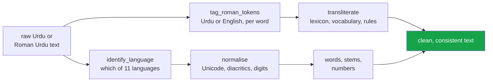

<h1 align="center">urdunlp (Python · Unicode normalisation · transliteration · language ID)</h1>
<p align="center"><i>Urdu and Roman Urdu text processing, scored against people. Pure Python, zero dependencies, no model downloads</i></p>

<p align="center">
  <a href="#why-this-exists">Why this exists</a> &middot;
  <a href="#measured-against-people">Measured against people</a> &middot;
  <a href="#what-it-does">What it does</a> &middot;
  <a href="#install">Install</a> &middot;
  <a href="https://github.com/hammasbuilds/urdunlp/blob/main/docs/CORPUS.md">Every number, with its method</a> &middot;
  <a href="#known-limits">Known limits</a> &middot;
  <a href="#problems-hit-while-building-this">Problems hit</a>
</p>

<p align="center">
  <a href="https://github.com/hammasbuilds/urdunlp/actions/workflows/ci.yml"></a>
  <a href="https://pypi.org/project/urdunlp/"></a>
  
  
  
  <a href="https://github.com/hammasbuilds/urdunlp/blob/main/LICENSE"></a>
</p>

---

## Why this exists



**Zero dependencies and no model downloads.** Urdu tooling usually assumes a GPU and a
multi-gigabyte model; most preprocessing does not need either, and requiring them puts the
language behind a hardware barrier that English does not have.


Urdu is the national language of a country of 240 million people, and the tooling for
it is close to nonexistent. Every Urdu project starts by rewriting the same few
things badly. This is those things, written once, with tests - and, since 0.2, with
an accuracy figure for each one, measured on data it was not built from.

## Measured against people

Version 0.1 had no accuracy figure for transliteration, and its docs said the data to
measure one "does not exist for Urdu at any useful scale". It does: Google's
[Dakshina](https://github.com/google-research-datasets/dakshina) dataset had native
speakers romanise ~10,000 Urdu Wikipedia sentences by hand. Scored against them, 0.1 got
**43.1%** of words right. 0.2 gets **91.2%**. Every row below is on held-out data:

| | 0.1 | **0.2** | measured on |
|---|---:|---:|---|
| Roman → Urdu, word accuracy | 43.1% | **91.2%** | 52,087 words of hand-romanised test sentences |
| Urdu → Roman, spelled as a person spelled it | 28.6% | **54.9%** | 52,087 words of test sentences |
| Urdu → Roman → Urdu round trip | 42.0% | **94.3%** | 15,098 tokens of held-out sentences |
| Grouping spelling variants (`nahi`, `nhi`, `naheen`), B-cubed F1 | 0.577 | **0.831** | 10,517 test-lexicon spellings |
| Which of 11 Perso-Arabic languages (whole paragraph) | — | **97.9%** | 1,254 test paragraphs |
| ... on 20 characters | — | **91.0%** | |
| English words found inside Roman Urdu (recall) | — | **87.3%** | synthetic code-mixed test sentences |
| Stemming, retrieval recall@10 | — | **+0.008** | 2,583 test queries, sign test p = 0.019 |

The numbers that did not come out well are in that table too, on purpose. The stemmer
helps a little. `identify_language` is reliable on a sentence and guesses between
neighbours on a word. `is_urdu` - a script check - turned out to say yes to **99.9% of
Persian and 99.5% of Arabic**, which is why `identify_language` exists.
&#128202; **[Method, splits and every number &rarr;](https://github.com/hammasbuilds/urdunlp/blob/main/docs/CORPUS.md#7-transliteration-scored-against-people-431--907)**

### The problem nobody handles: the same word has several encodings

Urdu uses a Perso-Arabic script, and text scraped from the web freely mixes Arabic
codepoints with Urdu ones, because most keyboards and many fonts do not distinguish
them:

| Looks like | Arabic codepoint | Urdu codepoint |
|---|---|---|
| ی | `U+064A` ARABIC YEH | `U+06CC` FARSI YEH |
| ک | `U+0643` ARABIC KAF | `U+06A9` KEHEH |
| ہ | `U+0647` ARABIC HEH | `U+06C1` HEH GOAL **or** `U+06BE` DOACHASHMEE HE |

The third row is not a typo. `ه` is the one substitution with **two** possible answers:
Urdu writes an ordinary *h* as `ہ` and aspiration as `ھ`, and which one a stray `ه` stands
for depends on the letter before it. Mapping it to `ہ` everywhere — the obvious reading,
and what this README used to say — is correct for
[9.0% of the corpus occurrences, against 96.9% for resolving by
context](https://github.com/hammasbuilds/urdunlp/blob/main/docs/CORPUS.md#the-obvious-mapping-for-arabic-heh-is-wrong-nine-times-in-ten).

They render identically and compare unequal. Without normalisation, exact match fails,
vocabularies fragment, and every downstream model quietly learns three versions of the
same word.

```python
normalize("كتاب") == normalize("کتاب")   # True. Without it: False.
```

**Measured on 84,581 BBC Urdu news articles** (44.7M tokens): **7,495 articles — one in
eleven — contain an Arabic codepoint standing in for an Urdu one.** 20,555 occurrences of
`U+064A` ARABIC YEH alone, in professionally edited copy. Unicode NFC does not touch any of
them, because they are genuinely different letters used by different languages.

&#128202; **[Every claim on this page, measured against the corpus &rarr;](https://github.com/hammasbuilds/urdunlp/blob/main/docs/CORPUS.md)**

### Roman Urdu, which is what people actually type

Most Pakistanis type Urdu in Latin script — in messages, comments, reviews, support
tickets. It has **no standard orthography**:

```
نہیں  ->  nahi, nahin, nhi, nahee, naheen
ہے    ->  hai, hay, he, h
```

This library does not pretend that is solved. It works in three stages and **tells you
which one answered**:

```python
r = transliterate_with_confidence("mera naam Ali hai")
r.text               # 'میرا نام علی ہے'
r.lexicon_coverage   # 0.5  — half from the curated lexicon
r.sources            # [('mera','lexicon'), ('naam','vocabulary'),
                     #  ('Ali','vocabulary'), ('hai','lexicon')]
```

1. **Lexicon.** A curated map of the closed-class vocabulary — pronouns, postpositions,
   auxiliaries — which is where most tokens in real text are, and which is the most
   irregular. 96.6% right on held-out sentences.
2. **Vocabulary** (new in 0.2). A noisy-channel search over 60,638 real Urdu words for the
   one most likely to have been typed as this Roman string. This is where `Ali` finds
   `علی`: ع cannot be written in Roman, but علی is a word and the rule-built `الی` is not.
   It is also where `baad` finds بعد, `taur` finds طور and `haasil` finds حاصل. The
   sentence is chosen as a whole, with a word-bigram model, so the lexicon's answer can be
   overruled by context: `us ne kaha ke` gives کہا **کہ**, not کہا کے.
3. **Rules.** Longest-match grapheme substitution for what is left — 0.4% of words in
   held-out text, mostly names. `rule_share` tells you how much of your input landed here.

In 0.1 there were only stages 1 and 3, and this example returned `الی` — correctly
labelled `rules`, and wrong. `use_vocabulary=False` still gives that behaviour.

The same machinery groups spelling variants — `roman_key("nahi") == roman_key("nhi") ==
roman_key("naheen") == "نہیں"` — and `tag_roman_tokens` finds the English inside Roman
Urdu (`kal meeting cancel ho gayi`), which `keep_english=True` leaves in Latin script.

**"Where most tokens actually are" is measurable, so it was measured**: the 115-word
stopword list covers **41.4% of 44.7M tokens**, and 114 of the 115 entries appear in the
corpus at all.

### Urdu → Roman, spelled the way people spell it

The other direction was never scored against people either. Against Dakshina's held-out
words, 0.1's letter rules produced a spelling any annotator wrote **33.4%** of the time,
and matched what the annotator actually wrote in running text **28.6%** of the time:
`main theek hoon` came out `min thik hon`, کتاب came out `katab`, پاکستان `pakasatan`.

0.2 spells words the way people spell them: the curated lexicon for function words, the
commonest spelling annotators wrote for the ~24,000 words Dakshina covers, and for
everything else a spelling generated from the same letter model that reads Roman Urdu.

| test split | 0.1 rules | **0.2 learned** |
|---|---:|---:|
| words spelled as some annotator spelled them (lexicon) | 33.4% | **54.1%** |
| sentence words spelled exactly as that annotator did | 28.6% | **54.9%** |
| sentence words spelled as any annotator spelled that word | 41.4% | **77.9%** |
| Urdu → Roman → Urdu round trip | 90.8%* | **94.3%** |

*\*with the 0.2 Roman → Urdu stage. With 0.1's rules both ways, the round trip was
44.7% on BBC news and 42.0% on these sentences.*

0.1 made you choose: readable output (short vowels inserted) or reversible output (the
literal mapping, `insert_short_vowels=False`). The learned spellings are both at once.
`method="rules"` keeps the 0.1 mapping for anyone who wants letters, not words.

## What it does

| Module | |
|---|---|
| `normalize` | Arabic↔Urdu unification, diacritics, tatweel, zero-width, digits, punctuation. `is_urdu()` script detection. |
| `tokenize` | Sentence splitting on `۔` and `؟`, word tokenisation, merged-compound repair, character n-grams. |
| `translit` | Roman Urdu ↔ Urdu script: curated lexicon, then a noisy-channel search over 60,638 words decoded a sentence at a time, then rules — with per-token provenance. `keep_english=True` leaves English in Latin script. |
| `roman` | `roman_key` / `group_roman_variants`: spelling variants grouped by the Urdu word they spell. |
| `langid` | `identify_language` over eleven Perso-Arabic-script languages, with letter evidence; `tag_roman_tokens` labels each Roman word `ur` or `en`. |
| `numbers` | Urdu and Roman Urdu number words ↔ values, including ڈیڑھ ڈھائی سوا ساڑھے پونے and lakh/crore; ordinals (تیسرا، پانچویں، یکم); `find_numbers` in running text; `12,34,567` grouping. |
| `stem` | Rule-based suffix stripping for retrieval keys. |
| `stopwords` | 115 function words — **with negation held separately**. |

### Three details that are usually wrong elsewhere

**Urdu punctuation lives inside the Arabic block**, interleaved with the letters. A
range like `؀-ۿ` silently swallows `،` `؟` `۔` into your word tokens. The letter
ranges here skip each punctuation codepoint individually.

**`ھ` (do-chashmi he) marks aspiration**, not a separate consonant — `کھ` is one
sound. Transliterating it as its own letter turns کھانا into `kahana`. It is also a
different codepoint from standalone `ہ`, and confusing the two is the most common
mistake in machine-produced Urdu.

**Negation is not a stopword.** `نہیں` carries the entire meaning of a sentence, and
a stopword list that deletes it inverts every sentiment label. It is kept in a
separate `NEGATION` set and preserved by default:

```python
remove_stopwords(words("یہ اچھا نہیں ہے"))   # ['اچھا', 'نہیں']  — negation survives
```

## Install

```bash
pip install urdunlp
```

The distribution is `urdunlp`, which is also the import name. **It is not on PyPI
yet** — the badge above will show a version once the first release is uploaded. Until
then, install from the repository:

```bash
pip install git+https://github.com/hammasbuilds/urdunlp
```

No dependencies, deliberately. This is the layer other Urdu projects sit on, and a
dependency here becomes a dependency of all of them.

The package is **typed** — `py.typed` ships in the wheel, so mypy and pyright see every
annotation rather than falling back to `Any`.

"No model downloads" still holds in 0.2: the transliteration vocabulary, the language
tables and the Roman tagger ship inside the wheel as three gzipped JSON files, 3.4 MB
together, loaded on first use in about 0.6 s. There is nothing to fetch at runtime.

From a clone, there is nothing to install at all:

```bash
git clone https://github.com/hammasbuilds/urdunlp
cd urdunlp
python demo.py
pytest -q          # 358 tests, no install step needed
```

---

## Input

One deliberately messy sentence: Arabic `ک` and `ی` rather than the Urdu forms, doubled
spaces, a URL and an English mention.

```
میں  کل  لاہور  سے  آیا  ہوں۔ http://x.co @ali
```

## Output

`python demo.py`

```
remove_urls_and_mentions میں کل لاہور سے آیا ہوں۔
normalize                میں کل لاہور سے آیا ہوں۔
words                    میں کل لاہور سے آیا ہوں
remove_stopwords         کل لاہور آیا
transliterate_to_roman   main kal lahore se aaya hoon.

6 tokens in, 3 content words out (3 stopwords removed)

Roman -> Urdu, and which stage answered:
   mera naam Ali hai            -> میرا نام علی ہے    [lexicon vocabulary vocabulary lexicon]
   is ke baad taur par haasil   -> اس کے بعد طور پر حاصل    [vocabulary lexicon vocabulary vocabulary lexicon vocabulary]
   dekho http://x.co par        -> دیکھو http://x.co پر    [vocabulary identifier lexicon]

Spelling variants, grouped by the Urdu word they spell:
   نہیں     nahi, nhi, naheen
   اچھا     acha, accha, achha

English inside Roman Urdu:
   kal meeting cancel ho gayi   -> kal/ur meeting/en cancel/en ho/ur gayi/ur
   keep_english=True            -> کل meeting cancel ہو گئی

Script is not language - every one of these passes is_urdu():
   یہ کتاب میری ہے اور میں اسے پڑھتا ہوں    -> Urdu     right  
   هذا الكتاب لي وأنا أقرأه                 -> Arabic   right  
   هي ڪتاب منهنجو آهي                       -> Sindhi   right  sd:ڪ
   دا کتاب زما دی او زه یې هره ماښام لولم   -> Pashto   right  ps:ښې ug:ې
   دا کتاب زما دی                           -> Punjabi (Shahmukhi) WRONG, it is Pashto - four words is too few  

Inflected forms, stemmed to one retrieval key:
   کتاب کتابیں کتابوں لڑکا لڑکے لڑکیاں  -> کتاب کتاب کتاب لڑک لڑک لڑک

Numbers, with the fractions English has no word for:
   ڈیڑھ لاکھ      = 1,50,000
   سوا دو کروڑ    = 2,25,00,000
   15 lakh        = 15,00,000
```

*A transliterated URL is a broken URL, so URLs, emails, `@mentions` and `#hashtags` pass
through untouched. The language list includes one wrong answer on purpose: four words of
Pashto read as Punjabi. Short text is where language identification is weakest, and a
demo that only showed the cases that work would hide that.*

*Shown as text, not a screenshot: Urdu is a joining right-to-left script, and an image
renderer without HarfBuzz shaping produces disconnected letters in the wrong order.*

---

## Tests

```bash
pytest
```

**358 tests.** Each encodes a real property of the language rather than a convenient
example, so a failure means the library is wrong about Urdu, not about a fixture. They use
only what ships in the package; the evaluation data under `data/` is for the measurement
scripts and is never read by a test.

## Known limits

Stated plainly, because a toolkit that overclaims wastes its users' time:

- **Roman → Urdu is ambiguous by nature, and one word of context is not much.** `ke`
  is کے (*of*) or کہ (*that*); a bigram model gets it right after کہا, and not where
  the deciding word is further back. `sher` is شیر or شعر whatever precedes it. On
  held-out hand-romanised sentences 9.3% of words still come out wrong.
- **The accuracy figures are for careful romanisation.** Dakshina's annotators
  transcribed encyclopaedia sentences. Chat is shorter, drops more vowels and switches
  to English more; it will score lower, by an amount nobody has measured.
- **English inside Roman Urdu is found, not perfectly.** `tag_roman_tokens` finds 87.3%
  of English words in synthetic code-mixed sentences and mislabels 1.6% of English as
  Urdu. By default English words are transliterated the way Urdu writes them
  (`station` → اسٹیشن), which is usually what an Urdu reader wants; `keep_english=True`
  leaves tagged words in Latin script instead. Names are the weak spot either way.
- **Language identification needs a sentence.** 97.9% on a paragraph, 91.0% on twenty
  characters, 81.5% on ten — and the errors fall between Urdu, Punjabi and Saraiki,
  which share most of their letters and much of their vocabulary. `margin` flags some
  of the doubtful cases, not all of them.
- **Urdu → Roman is lossy and one-way.** س ص ث all give `s` in the Roman output, and
  nothing in that direction can restore the distinction. Going back, the vocabulary
  stage recovers most of it for words that exist — 94.3% round-trip on held-out
  sentences — and none of it for names.
- **Short vowels are inserted heuristically.** Urdu does not write them, so a literal
  mapping gives `jmlh` for جملہ. An `a` between consonants gives `jamalah` — right
  more often than not, wrong sometimes, and disabled with `insert_short_vowels=False`.
- **Feeding Urdu to the Roman → Urdu direction is a no-op, and says so.** Tokens
  already in Urdu script are reported as `already-urdu`, and `already_urdu_share`
  tells you.
- **Compound-splitting is a fixed list**, not a model. Deliberately: an aggressive
  splitter does more damage than an incomplete one.
- **The stemmer is a stemmer.** It produces retrieval keys (لڑکا, لڑکی → لڑک), not
  lemmas, and the retrieval gain is small: +0.008 recall@10 on one task, not
  significant on the other. There is still no lemmatiser; that needs a lexicon that
  does not exist openly.
- **The bundled data is CC BY-SA.** The code is MIT. The three model files are derived
  from Dakshina, Wikipedia and HotpotQA, all CC BY-SA 4.0; if you redistribute the
  models, that licence applies to them.

## Keywords

Urdu NLP &middot; Roman Urdu &middot; transliteration &middot; language identification &middot; code-mixing &middot; Shahmukhi &middot; Sindhi &middot; Pashto &middot; noisy channel &middot; stemmer &middot; lakh crore &middot; Unicode normalisation &middot; text preprocessing &middot; tokenization &middot; word segmentation &middot; low-resource languages &middot; South Asian languages &middot; Nastaliq &middot; Arabic script &middot; zero dependencies &middot; pure Python &middot; diacritics &middot; language tooling

## License

Code: MIT. Bundled model data (`src/urdunlp/data/`): derived from
[Dakshina](https://github.com/google-research-datasets/dakshina) (Roark et al., 2020),
Wikipedia and [HotpotQA](https://hotpotqa.github.io/), each CC BY-SA 4.0.

---

## Run it yourself

```bash
git clone https://github.com/hammasbuilds/urdunlp
cd urdunlp

pytest -q               # 358 tests, no install step needed
python demo.py          # see it work
```

```python
from urdunlp import normalize, transliterate_to_urdu, words, remove_stopwords

normalize("كتاب")                          # 'کتاب'
transliterate_to_urdu("main theek hoon")   # 'میں ٹھیک ہوں'
words("کیا، واقعی؟", keep_punctuation=True)
remove_stopwords(words("یہ اچھا نہیں ہے")) # ['اچھا', 'نہیں'] — negation kept

from urdunlp import roman_key, identify_language, tag_roman_tokens, parse_number, stem

transliterate_to_urdu("is ke baad taur par haasil")  # 'اس کے بعد طور پر حاصل'
roman_key("nhi") == roman_key("naheen")              # True — both 'نہیں'
identify_language("هي ڪتاب منهنجو آهي").name         # 'Sindhi'
tag_roman_tokens("kal meeting cancel ho gayi")       # [('kal','ur'), ('meeting','en'), ...]
parse_number("sawa do crore")                        # 22500000
stem("کتابوں")                                       # 'کتاب'
```

Works on Python 3.10–3.13, Linux and Windows. No model downloads, no GPU: the three
small statistical tables it needs are inside the package.

To reproduce the 0.2 measurements, fetch the evaluation data first (none of it is
needed to use the library or run the tests):

```bash
python scripts/fetch_dakshina.py            # Roman Urdu, 34 MB of a 2 GB archive
python scripts/fetch_wikipedia_samples.py   # 1,500 paragraphs in each of 11 languages
python scripts/measure_translit.py          # section 7 and 9 of docs/CORPUS.md
python scripts/measure_langid.py            # sections 10 and 11 (needs extract_english.py)
```

## Problems hit while building this

**Urdu punctuation lives inside the Arabic letter block.** The obvious range `؀-ۿ`
silently swallows `،` `؟` `۔` into word tokens, so `words("کیا، واقعی؟")` returned
`['کیا،', 'واقعی؟']` — punctuation glued to words, which corrupts every downstream
count. *Fixed* by enumerating letter sub-ranges that skip each punctuation codepoint
individually.

**`ھ` was treated as a standalone consonant.** It marks *aspiration* on the letter
before it — `کھ` is one sound — so inserting a vowel around it turned کھانا into
`kahana` instead of `khana`. *Fixed* by excluding it from vowel insertion, with a test.

**Short vowels do not exist in written Urdu.** A literal character mapping gives `jmlh`
for جملہ, which no Roman Urdu reader would write. *Fixed* with a heuristic `a`
insertion between consonants — right more often than not, and switchable off, because
pretending a heuristic is a rule is how a toolkit loses trust.

**Negation was almost a stopword.** The first stopword list included `نہیں`. That
single word carries the meaning of a sentence, and removing it inverts every sentiment
label. *Fixed* by holding negation in a separate set that is preserved by default.

**`pip install urdu-nlp-toolkit` did not work, and this README said it did.** The
package is not on PyPI. Anything that followed that instruction failed to install, which
is strictly worse than documenting no install method at all. *Fixed* by publishing the
`git+https` form that works today and saying plainly that PyPI is pending.

**`pytest` failed from a fresh clone.** The package lives in `src/`, so `import urdunlp`
only resolved after `pip install -e .`. CI does that before running tests, so CI was
green the whole time while anyone cloning the repository got `ModuleNotFoundError`. A
project whose claim is "zero dependencies, nothing to download" should not need an
install step to run its own tests. *Fixed* with a `conftest.py`.

**Urdu fed to the Roman → Urdu direction was reported as successfully transliterated.**
`_apply_rules` matches Latin graphemes only, so an Urdu token passed straight through —
the right output, labelled `rules`, as though the rule engine had resolved it. With
`lexicon_coverage` then reading `0.0`, a call in the wrong direction looked like a
confident bad guess rather than a no-op. *Fixed* with an `already-urdu` source and an
`already_urdu_share` property.

**The README's own transliteration example was wrong.** It showed
`mera naam Ali hai` → `میرا نام علی ہے`. The code returns `الی`, because ع is unwritable
in Roman and no lexicon covers proper nouns. The published output was what a reader
expects rather than what the function does. *Fixed*, and pinned by a test so the
documented example cannot drift from the code again.

**The normaliser advertised a mapping it did not have, and the obvious version of it
would have been wrong.** The module docstring named three examples of the problem it
solves, and the third — `ه` U+0647 ARABIC HEH → `ہ` U+06C1 HEH GOAL — was not in the
mapping table at all. The measurement script missed it for the same reason: its
substitution list and the table were written from the same list of letters, so the
measurement shared the code's blind spot and reported a clean result for the part nobody
had looked at. Worse, implementing what the docstring said would have made things worse:
`ه` has *two* Urdu counterparts, `ہ` (ordinary *h*) and `ھ` (aspiration), and adjudicating
all 977 corpus occurrences against the vocabulary gives **9.0% correct for "always `ہ`"
against 96.9% for resolving by the preceding consonant.** A keyboard missing `ھ` is a
keyboard missing *bh, ph, th, kh, gh*, which is where the substitution actually appears.
*Fixed* with `resolve_arabic_heh`, exported and documented as a heuristic — the residual
3.1% are words like بہار (spring) and بھار (weight) that differ only in this letter.

**`fix_spacing` missed a fifth of the compounds it exists to repair.** It split the
input on whitespace, so any punctuation stayed glued to the token: `کردیا` matched the
table and `کردیا۔` did not. These are perfective auxiliaries, so the end of a clause is
exactly where they sit. Across all 84,581 articles there are **60,305 occurrences of the
19 compounds, and whitespace splitting found 48,582 — missing 11,723, or 19.4%.** The
per-word split is the proof: the completive `ہوگئے` was missed **34.2%** of the time and
`کردیں` **35.6%**, while the progressive `کررہے`, which sits mid-clause, was missed
**0.7%**. *Fixed* by matching word spans, which also stopped the function reflowing the
whole document — `" ".join(text.split())` collapsed every newline and indent as a side
effect of inserting one space.

**A measurement script that measured nothing.** The first version of
`scripts/measure_corpus.py` computed `normalize(t) != t` over tokens from `words()` —
but `words()` normalises internally, so the comparison was false for every token by
construction. It reported a 0% normalisation rate across 247,064 tokens, which reads
like a finding and is a tautology. *Fixed* by measuring against raw whitespace tokens.
A second version round-tripped with `transliterate_with_confidence`, which is the
*Roman → Urdu* direction: fed Urdu it returns the input untouched, so the round-trip was
identity in, identity out, and reported **99.96%**. The real figure is 44.7%.

**The transliterator had never been scored, and the reason given was false.**
docs/CORPUS.md said accuracy "needs human-checked pairs, which do not exist for Urdu at any
useful scale". Google's Dakshina dataset had existed since 2020, with ~10,000 Urdu
sentences romanised by hand. Scored against it, 0.1 got **43.1%** of words right, and the
rules — which handled two thirds of running text — got **16.5%** of theirs. Two mechanical
errors dominated: a word-initial vowel with no carrier (`is` → یس for اس) and short vowels
written out that Urdu leaves unwritten (`jis` → جیس for جس). *Fixed* by a vocabulary stage
that searches real words rather than building one letter by letter: **87.0%**, and
**90.7%** once each sentence is decoded as a whole.

**The data the fix was measured on leaked into the data it was built from.** Dakshina's
romanised sentences come from its held-out Wikipedia partition, and the vocabulary is counted
from its training partition. Checked instead of trusted: **9.4% of the dev and test
sentences occur verbatim in the training partition.** *Fixed* by dropping every such line
before counting — 7,348 of them — and by dropping from dev the 42 sentences that Dakshina
put in dev and test both.

**`is_urdu` says yes to Arabic.** And to Persian, Pashto, Sindhi, Kurdish, Uyghur — to
94-99.9% of paragraphs in every one of eleven languages written in the same script, and to
Urdu *least* often of all, because Urdu Wikipedia's stubs carry Latin names. It was always
a script check; the name promised more. *Fixed* by `identify_language`, and `is_urdu` keeps
its behaviour and its name, documented as what it is.

**A docstring claimed a property the measurement then refused.** `identify_language`'s
`margin` was documented as "almost every error has a margin below 0.05". On held-out
20-character windows, most errors — 31 of 44 — came with a margin above 0.1. Naive Bayes is
confidently wrong when two languages share every word in a short window. *Fixed* by
rewriting the docstring from the measurement, not the other way round.

**The number parser failed on ordinary numbers.** پانچ سو تیس (530) raised "two numbers in
a row", because تیس arrived while 500 was still open — so every hundred that was not a round
one was rejected. And ایک ہزار کروڑ, a thousand crore, came out as 10,010,000,000: an implied
"one" before کروڑ was added to the thousand. A round-trip test over 200,000 values passed
throughout, because `number_to_words` never writes either form. *Fixed*, and both found by
writing tests from how people write numbers rather than from how the formatter does.

**Fixing Germany broke gaari.** Letting `g` stand for ج as well as گ (so `germany` can find
جرمنی) made `gaari` resolve to جاری, a far more common word, instead of گاڑی. Measured on dev
sentences rather than argued: keeping the alternative is worth +0.15 points net, so it
stays, and `gaari` is a known casualty. Two other alternatives changed nothing at all and
were removed.

**Four tests failed because the library got better.** They pinned 0.1's limits — `Ali` →
الی, and round trips that "no setting recovers". With the vocabulary stage, `srf` comes back
as صرف. Deleting the tests would have lost the record of what the rules alone cannot do, so
they now pin that under `use_vocabulary=False`, and new tests pin what the vocabulary
recovers.

**A stemmer benchmark that could not see stemming.** Title-to-body retrieval, reused from
nlp-lab so the numbers compare, uses article titles as queries — and titles are mostly
names, which do not inflect. A +0.008 gain there says little about the stemmer. *Added* a
second task whose queries are ordinary prose (each article's lead sentence), and a sign
test. It moved less (+0.005, p = 0.32). Both are reported; neither is dressed up.

**A URL moved every English tag three words to the right.** `keep_english=True` first
tagged the raw text, where `http://x.co` is three Latin words — `http`, `x`, `co` — and
then applied the tags to the words the transliterator sees, where the URL is one
identifier and not a word at all. Every tag after a URL landed on the wrong word:
`dekho http://x.co kal meeting cancel ho gayi` kept `ho` and `gayi` in Latin script and
transliterated `meeting`. Found reading the code before release, not by a test — the
tests had no sentence with both a URL and English in it. *Fixed* by tagging exactly the
words the transliterator will process, and pinned by a test that has both.

**Adding context made single words worse.** Decoding each sentence with a word bigram model
took held-out accuracy from 88.4% to 90.7% - and the round trip, which transliterates one
word at a time, fell from 90.8% to 88.2%. A lone word was being decoded as a one-word
sentence, so it was scored by how often words *start* sentences. *Fixed* by sending a
single word down the word-by-word path, where there is no context to misuse; the round
trip is back to 90.8%. The sentence benchmark could not have caught this - it has no
one-word sentences - which is why a feature is measured on more than the benchmark it
was tuned on.

**A hardening pass found eleven ways real input broke it.** A fuzzer threw 20,000
adversarial inputs at all 23 public entry points - mixed scripts, emoji, zero-width
marks, lone surrogates, control characters - and found no crash. Reading the outputs by
hand found the bugs a crash count cannot:

| found | was | now |
|---|---|---|
| `price 2.5 crore` | `2. 5` - tokens rejoined with single spaces | the input's own spacing, exactly |
| `kal
parso` | line break lost | kept, and it ends the sentence context |
| `0300-1234567`, `25-12-2024`, `3:30`, `1,500` | split at every mark | one token, untouched |
| `5th`, `mp3` | `5` + the Roman word `th` | passed through |
| `BBC`, `TV`, `U.S.A` | sounded out as words | بی بی سی, ٹی وی, یو ایس اے - letter names, as Dakshina's annotators wrote TV 25 times of 25 |
| `café` | `کفé` | passed through |
| `find_numbers` offsets | indexed the *normalised* text | index the text you passed |
| `ایک لاکھ، دو ہزار` | one number, 102,000 | two numbers - punctuation ends a phrase |
| `۱۲٫۵` | 12 and 5 | 12.5 |
| `کروڑ ہزار` | 10,001,000 | rejected |
| `format_number(1e-05)` | `IndexError` | `0.00001` |

Two more were about scale and one about types. Transliteration copied the whole path at
every word: 50,000 words with no full stop took 36 s, and 200,000 now take 7 s.
`find_numbers` re-read a run of number words from every start at every length: 5,000 of
them took 60 s, now 0.4. And a wrong type got five different answers - `normalize(None)`
returned `''`, `roman_key(None)` raised `AttributeError` from deep inside,
`is_urdu(['kal'])` returned `False` - where every function now raises the same
`TypeError` naming itself. `mypy --strict` found the last one: the model loader called
`joinpath` with two arguments, which a zipped install on Python 3.10 does not accept.
All of it is pinned in `tests/test_robustness.py`.

**Half the library had never been scored against people.** Roman → Urdu had been, and
was at 90.7%; Urdu → Roman had only ever been round-tripped. Scored against Dakshina's
annotators it wrote a spelling a person wrote for **33.4%** of held-out words - `min thik
hon` for میں ٹھیک ہوں. It also silently deleted Urdu digits. *Fixed* by spelling words the
way the model that reads Roman Urdu expects them: **54.1%**, and 54.9% exactly as the
annotator wrote it in running text, up from 28.6% - and it round-trips better too, 94.3%
against 90.8%, so 0.1's "readable or reversible, pick one" is gone. Language
identification moved from 1-3-grams to pruned 1-5-grams (84.2% → 88.3% on ten
characters). One attempted fix did nothing - giving the English tagger a spelling for all
60,638 vocabulary words left its false-alarm rate at 3.6%, because most of those "false
alarms" are real English - and it was not shipped.

**The test set that looked best was too small to trust.** Language identification had been
scored on 57-80 held-out paragraphs per language. Growing the Urdu, Punjabi and Saraiki
samples from 1,500 to 5,000 paragraphs grew their test sets too - and the *unchanged* model
scored 96.4% on the larger test set, not the 99.5% published from the smaller one. Punjabi
alone went from 95.8% to 89.3%. The larger training sample then lifted it back: 97.9%
overall, Punjabi 97.3%. The headline number went down and the model got better; the table
above now reports the larger test set. Adding a prior for Urdu was tried to win back its
short-window accuracy and was dropped - every point it gave Urdu it took from Punjabi.

**Two ideas measured and not shipped.** Generating a spelling for Roman words the
vocabulary does not hold was right 18% of the time on those words, against 7% for the
rules - but as a candidate in the decoder it cost 0.31 points overall, because an invented
word that looks plausible beats a real one too often. A stemmer that only strips a suffix
when what is left is a known word scored the same as the plain one. Both are recorded in
docs/CORPUS.md so nobody spends the afternoon on them again.

